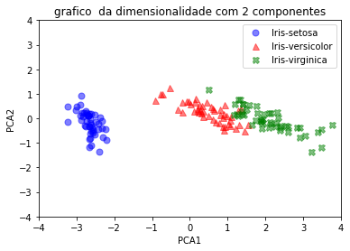

# Principal Component Analysis - Iris

Autor:

- **Jeffri Erwin Murrugarra Llerena**
    * *USP #* **10655837** 

## Resumo
   Implementação da técnica Principal Component Analysis(PCA) no conjunto de dados Iris.

## Apresentação
   - **Iris** : O conjunto de dados contém 3 classes de 50 instâncias cada classe,onde cada classe se refere a um tipo de planta
 
   - **PCA** : É um procedimento estatístico que usa uma transformação ortogonal para converter um conjunto de observações de variáveis possivelmente correlacionadas em um conjunto de valores de variáveis linearmente não correlacionadas, chamadas componentes principais.

## Descrição de atividades
   - Ler o dataset iris, excluir a classe Y
 
   - Padronize os dados X_i para estes tenham média igual a 0 e variância igual a 1
 
   - Calcule a matrix de covariância
 
   - Obter os autovetores e autovalores
 
   - Ordenar de forma decrecente
   - Fazer a redução de dimensionalidade( escolher k compenentes ) 
 
   - Construa os novos dados a partir das componentes principais

## Resultados
### Autovalores em forma creciente ###
 
 | PCA1 | PCA2 | PCA3 | PCA4 |
 | ---- |:----:| ----:| ----:|
 | 4.204387062618799 | 0.2431457932719668| 0.07905127565884043 | 0.023843040588977134 |
 
### Responsabilidade na variância ###
 | PCA1 | PCA2 | PCA3 | PCA4 |
 | ---- |:----:| ----:| ----:|
 | 92.39543681440453% | 5.343361932275352% | 1.7372275759703761% | 0.5239736773497581% |

### Reconstrução dos dados com 2 componentes principais ###
 
 
 
## Conclusões
 
  - Redução da dimensionalidade com 2 componentes,é responsavel do  97.738798746679882% da variância
  - Pode-se enxergar que uma classe é linearmente separável das outras dois
